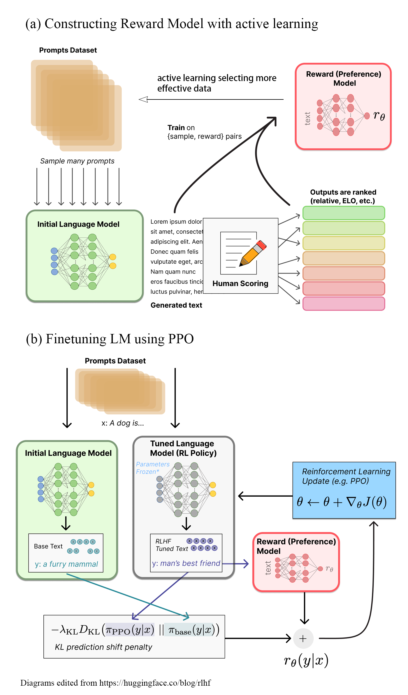

# Source code for comp0087

Active learning (AL) is a widely-used tech- nique in supervised learning tasks to miti- gate the costs and time associated with la- beling data. Reinforcement learning for hu- man feedback (RLHF) is a novel approach to align language models with human pref- erences. In this study, we propose a new framework, ARLHF, which augments con- ventional RLHF with active learning. The use of active learning is expected to alleviate the challenge of collecting high-quality hu- man feedback, which is often a laborious and time-consuming process. Our results, how- ever, did not demonstrate a clear advantage of active learning in the task of text sum- marization, largely due to the considerable cost of tuning each model in the workflow. Future work could concentrate on address- ing the limitations of active learning in large datasets and refining the selection of hyper- parameters to enhance the efficiency and ac- curacy of text summarization.
